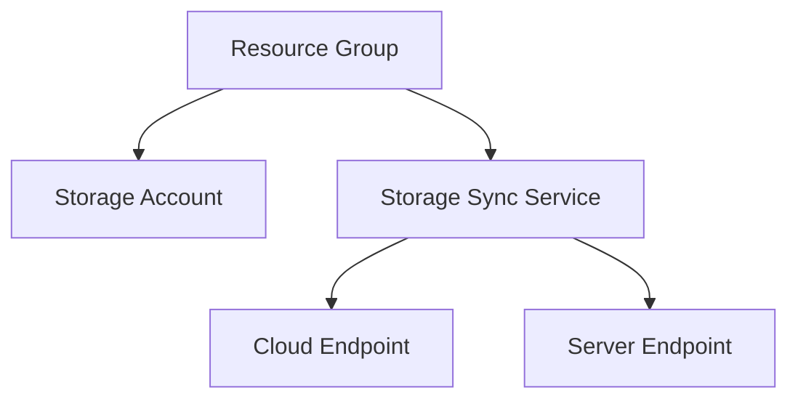

# Storage Sync Services (Azure File Sync)


## Overview
This project automates the deployment of an Azure Storage Sync environment using Terraform. It consists of modularized components for resource group creation, storage account setup and storage sync services.

## Project Structure

```
storage-sync/
├── module-rg
│   ├── rg.tf
│   ├── outputs.tf
│   └── variables.tf
├── module-storage
│   ├── basicstorage.tf
│   ├── outputs.tf
│   └── variables.tf
├── module-storage-sync-service
│   ├── storagesync.tf
│   ├── cloudendpoint.tf
│   ├── outputs.tf
│   └── variables.tf
├── module-server-endpoint
│   ├── serverendpoint.tf
│   ├── outputs.tf
│   └── variables.tf
├── main.tf
├── providers.tf
├── variables.tf
├── terraform.tfvars
├── outputs.tf
└── README.md
```

- **module-rg**: Creates the resource group for all resources.
  - `rg.tf`: Defines the resource group.

- **module-storage**: Manages the storage account.
  - `basicstorage.tf`: Configures the storage account with necessary settings.

- **module-storage-sync-service**: Configures the storage sync service.
  - `storagesync.tf`: Sets up the storage sync service.
  - `cloudendpoint.tf`: Configures the cloud endpoint for syncing.

- **module-server-endpoint**: Sets up the server endpoint.
  - `serverendpoint.tf`: Configures the server endpoint details.

- **Root Directory Files (storage-sync)**:
  - `main.tf`: Orchestrates module deployments.
  - `providers.tf`: Specifies provider configurations.
  - `terraform.tfvars`: Holds variable values for the project.
  - `variables.tf`: Contains global variables for project configuration.
  - `README.md`: Project documentation.

## Diagram


## Steps
