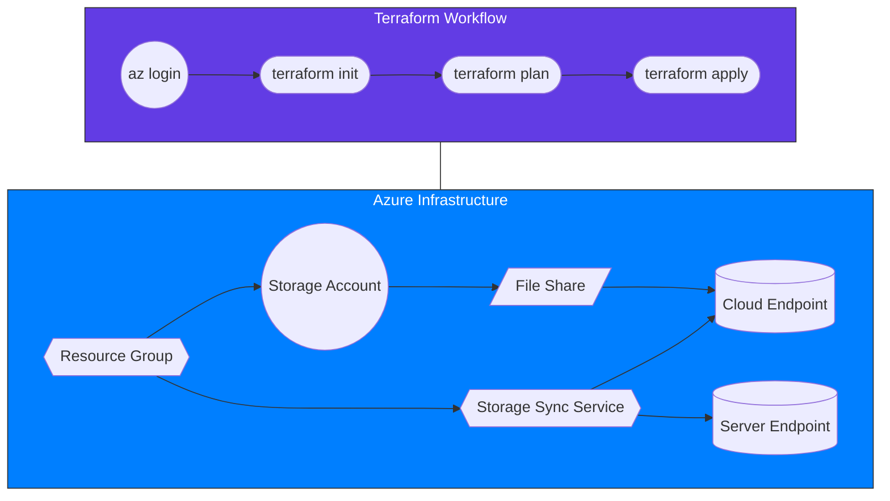

# Storage Sync Services (Azure File Sync)


## Overview
This project automates the deployment of an Azure Storage Sync environment using Terraform. It consists of modularized components for resource group creation, storage account and storage sync services and its components.

> [!IMPORTANT]
>
> When creating Azure File Sync cloud endpoints, remember that lower-level mechanisms like ARM templates or SDKs are used. Therefore, configuring the necessary permissions is the author’s responsibility:
> 
> For this use case, the following were utilized:
>
> **Terraform SPN:** `Contributor` and `Storage Account Contributor` and for a more restrictive access level, was created a custom role for `Azure File Sync Administrator`.
>
> **StorageSync Service:** Ensure the `Microsoft.StorageSync` application has `Reader and Data Access` permissions at the subscription level or Storage Account level.

> [!NOTE]
>  Microsoft public article request the credential identity to have `Owner` permission. [Create cloud endpoint](https://learn.microsoft.com/en-us/azure/storage/file-sync/file-sync-deployment-guide?tabs=azure-portal%2Cproactive-portal#create-a-sync-group-and-a-cloud-endpoint).
> 
> *"The administrator creating the cloud endpoint must be a member of the management role Owner for the storage account that contains the Azure file share the cloud endpoint is pointing to"*


## Project Structure

```
storage-sync/
├── module-rg
│   ├── rg.tf
│   ├── outputs.tf
│   └── variables.tf
├── module-storage
│   ├── basicstorage.tf
│   ├── outputs.tf
│   └── variables.tf
├── module-storage-sync-service
│   ├── storagesync.tf
│   ├── cloudendpoint.tf
│   ├── outputs.tf
│   └── variables.tf
├── module-server-endpoint
│   ├── serverendpoint.tf
│   ├── outputs.tf
│   └── variables.tf
├── main.tf
├── providers.tf
├── variables.tf
├── terraform.tfvars
├── outputs.tf
└── README.md
```

- **module-rg**: Creates the resource group for all resources.
  - `rg.tf`: Defines the resource group.

- **module-storage**: Manages the storage account.
  - `basicstorage.tf`: Configures the storage account with necessary settings.

- **module-storage-sync-service**: Configures the storage sync service.
  - `storagesync.tf`: Sets up the storage sync service.
  - `cloudendpoint.tf`: Configures the cloud endpoint for syncing.

- **module-server-endpoint**: Sets up the server endpoint.
  - `serverendpoint.tf`: Configures the server endpoint details.

- **Root Directory Files (storage-sync)**:
  - `main.tf`: Orchestrates module deployments.
  - `providers.tf`: Specifies provider configurations.
  - `terraform.tfvars`: Holds variable values for the project.
  - `variables.tf`: Contains global variables for project configuration.
  - `README.md`: Project documentation.

## Diagram


## 📝 Consideration of Project Structure

For this project, we will structure it into two parts:

- Part 1: 
  - Storage Account
  - File share
  - Storage Sync Service
  - Cloud endpoint
   
- Part 2:
  - Installation of the agent on server and server registration.
    - [Install the Azure File Sync agent](https://learn.microsoft.com/en-us/azure/storage/file-sync/file-sync-deployment-guide?tabs=azure-portal%2Cproactive-portal#install-the-azure-file-sync-agent)
  - Configuration of the server endpoint within the Storage Sync Service.

> [!NOTE]
> 
> The project is structured this way because we will need to manually intervene to install the agent on the server where the file server we want to synchronize is located. After this correct instalation and server registration, we will obtain the value for the `registered_server_id` variable, which will allow us to proceed with applying the `module-server-endpoint`.

> [!IMPORTANT]
> The project is structured as described here today, but it may undergo changes in the future to adopt a more automated approach.

## How to

### Part 1: 

In the first phase of this project, we begin with `terraform init`, followed by `terraform plan` to confirm that the configuration aligns with expectations. After verification, we run `terraform apply` to implement the changes. This phase targets the `rg, storage, and syncservice modules`, ensuring that core Azure infrastructure components are correctly set up and ready for the next stages.

```terraform
terraform init
```


```terraform
terraform plan -target=module.rg -target=module.storage -target=module.syncservice
```


```terraform
terraform apply -target=module.rg -target=module.storage -target=module.syncservice
```


> [!TIP]
> If you are not currently in the project folder, you can still initialize Terraform for the project by specifying the folder path directly. Use the following command:
>
> ```bash
> terraform -chdir=path/to/your/project init
> ```
>
> This allows you to initialize Terraform without needing to change directories.

### Part 2: 

